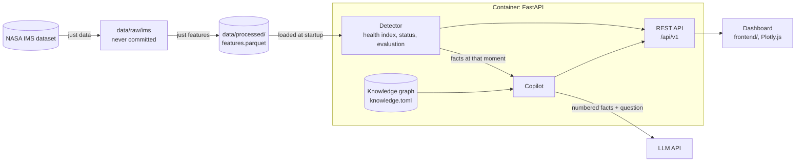
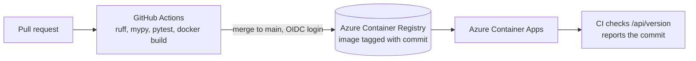

# Bearing Health Monitor

Condition monitoring for rolling bearings, built on the NASA IMS run-to-failure dataset:
vibration features → anomaly detection → health index → REST API → dashboard.

## Run locally

Requires [uv](https://docs.astral.sh/uv/) and [just](https://just.systems/)
(Windows: `winget install astral-sh.uv Casey.Just`).

```bash
just setup   # install dependencies and git hooks
just dev     # run the API with auto-reload
```

- Dashboard: http://localhost:8000
- API docs: http://localhost:8000/docs

## Checks

```bash
just lint    # ruff lint + format check, mypy
just test    # pytest
just check   # both, same as CI
just fmt     # apply lint fixes and formatting
```

Run `just` to list all recipes.

## Architecture





Endpoints (full schema at `/docs`):

- `GET /api/health`, `GET /api/version`: liveness and deployed commit, unversioned
- `GET /api/v1/experiments[/{experiment}[/bearings[/{bearing}]]]`: condition of runs and bearings; `?at=` as known then
- `GET .../bearings/{bearing}/features`: feature trends
- `GET .../bearings/{bearing}/health-index`: index and status per snapshot
  (`baseline`, `ok`, `crosstalk`, `alert`, `danger`)
- `GET .../bearings/{bearing}/ratios`: each feature over its baseline; the health index is the largest
- `GET /api/v1/experiments/{experiment}/evaluation`: hindsight per bearing (detected, missed, false alarm, quiet)
- `POST /api/v1/experiments/{experiment}/copilot?at=`: answer from cited facts; needs
  `ANTHROPIC_API_KEY` (see `.env.example`), else facts only

Code in `src/monitor/`:

- `ims.py`: dataset layout and checks
- `features.py`: time-domain and envelope features per snapshot
- `health.py`: detector, judges each snapshot only from the snapshots up to it
- `evaluation.py`: alarms vs. the documented failures (hindsight)
- `store.py`: loads the Parquet file, runs the detector, shapes responses
- `knowledge.py`, `knowledge.toml`: knowledge graph (networkx)
- `copilot.py`: retrieval and the model call
- `api.py`, `config.py`: routes and settings (`MONITOR_*` environment variables)

Dashboard: `frontend/`, served at `/`; `?run=set2&bearing=1&at=2004-02-16T04:12:39` opens a replay.
`MONITOR_FRONTEND_DIR` points at another build (e.g. React/Vite), `MONITOR_CORS_ORIGINS` allows a separate dev server.

## Data

[NASA IMS Bearing Dataset](https://www.nasa.gov/intelligent-systems-division/discovery-and-systems-health/pcoe/pcoe-data-set-repository/)
(J. Lee, H. Qiu, G. Yu, J. Lin, and Rexnord Technical Services, "Bearing Data Set",
NASA Prognostics Data Repository).

```bash
just data      # download (~1 GB) into data/raw/ims and validate it
just features  # compute data/processed/features.parquet (committed; rerun after changing features)
just evaluate  # detector results per bearing and vs. rms alone (tuned on set 2, tested on sets 1 and 3)
```

Unpacking needs bsdtar (built into Windows and macOS; `apt install libarchive-tools` on Linux).
